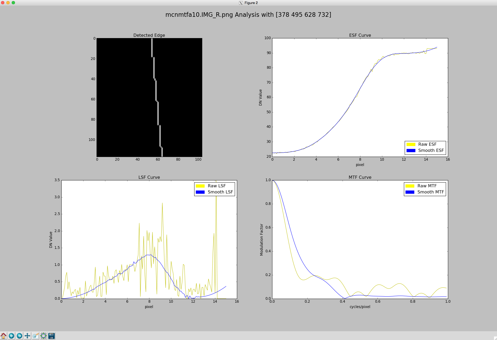

===============================================================
PDS_Compute_MTF - A Python Implementation to generate MTF Curve
===============================================================

* Implementation of Slant Edge Method for MTF in Python from PDS Image.
* Reference: http://www.mathworks.com/matlabcentral/fileexchange/28631-slant-edge-script/

Features
--------
* Allows user to select ROI containing edge in an image
* Detects Edge and generated LSF, ESF and MSTF Curves

Screen-Shots
------------
ROI Selection:

.. image:: docs/ScreenShots/ROI_Selection.png

Generated Plots:

Note
----
* Initial commits have some issues where it raises error. It will get fixed soon.

